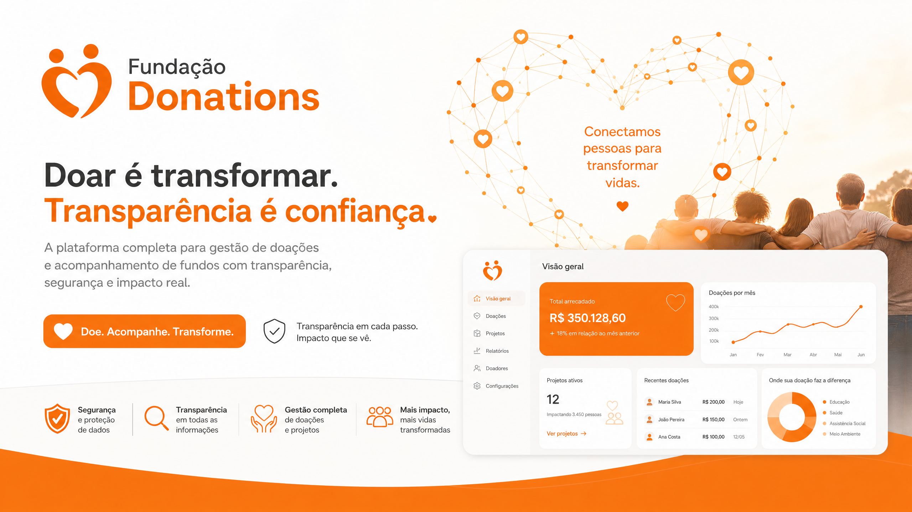

# 💖 Fundação Donations — Plataforma de Gestão de Doações e Campanhas

## Visão Geral

A **Fundação Donations** é uma plataforma completa e intuitiva, desenvolvida para simplificar a gestão de doações e campanhas de caridade para fundações e ONGs. Com foco na transparência, segurança e impacto real, esta solução digital capacita organizações a angariar fundos de forma mais eficiente e a comunicar o seu impacto de maneira clara e envolvente.

Desde a criação de campanhas personalizadas até ao acompanhamento detalhado das contribuições e a interação com doadores, a Fundação Donations oferece todas as ferramentas necessárias para maximizar o sucesso das iniciativas de caridade e construir uma comunidade de apoio sólida.

## ✨ Funcionalidades Chave

*   **Gestão Abrangente de Campanhas:** Crie, personalize e gerencie campanhas de doação com facilidade, incluindo metas, descrições detalhadas e imagens apelativas.
*   **Processamento Seguro de Doações:** Integração com métodos de pagamento seguros para garantir transações rápidas e protegidas, inspirando confiança nos doadores.
*   **Acompanhamento Transparente de Fundos:** Dashboard intuitivo que permite visualizar em tempo real o progresso das campanhas, o total angariado e a distribuição dos fundos, promovendo a transparência.
*   **Interação com Doadores:** Ferramentas para comunicar com os doadores, enviar agradecimentos personalizados e partilhar atualizações sobre o impacto das suas contribuições.
*   **Relatórios Detalhados:** Geração de relatórios completos sobre doações, campanhas e doadores, facilitando a análise e a prestação de contas.
*   **Perfis de Organização Personalizáveis:** Crie uma página dedicada para a sua fundação ou ONG, destacando a sua missão, projetos e histórias de sucesso.
*   **Partilha Social Integrada:** Facilite a divulgação das suas campanhas através de opções de partilha direta nas redes sociais, ampliando o alcance.

## 🚀 Benefícios para Fundações e ONGs

*   **Aumento da Angariação de Fundos:** Otimize as suas campanhas e alcance mais doadores com uma plataforma profissional e fácil de usar.
*   **Transparência e Confiança:** Construa uma relação de confiança com os seus doadores, mostrando o impacto real das suas contribuições.
*   **Eficiência Operacional:** Automatize tarefas administrativas e concentre-se no que realmente importa: a sua missão.
*   **Engajamento da Comunidade:** Mantenha os seus doadores informados e envolvidos, transformando-os em defensores da sua causa.
*   **Análise e Otimização:** Utilize os dados e relatórios para refinar as suas estratégias e maximizar o impacto das suas iniciativas.

## 🛠️ Tecnologias

Construído com uma stack tecnológica moderna e de alto desempenho para garantir fiabilidade e escalabilidade.

## 🤝 Contribuição

Convidamos a comunidade a contribuir para o aprimoramento da Fundação Donations. Se tiver ideias, sugestões de melhoria ou desejar colaborar, sinta-se à vontade para abrir uma issue ou enviar um pull request.

## 📝 Licença

Este projeto está licenciado sob a Licença MIT - consulte o arquivo `LICENSE` para detalhes.

**Construído com ❤️ para Fazer a Diferença.**
*Conectando corações, transformando vidas.*
